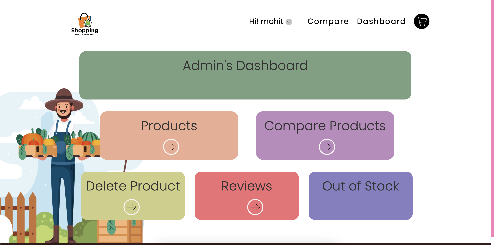
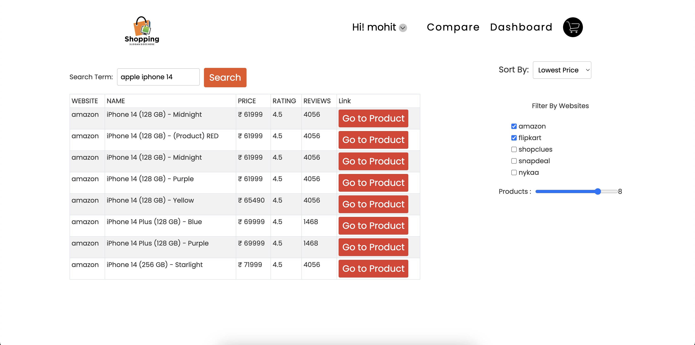
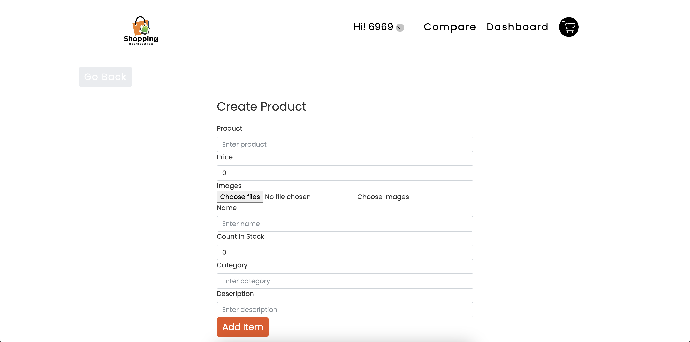
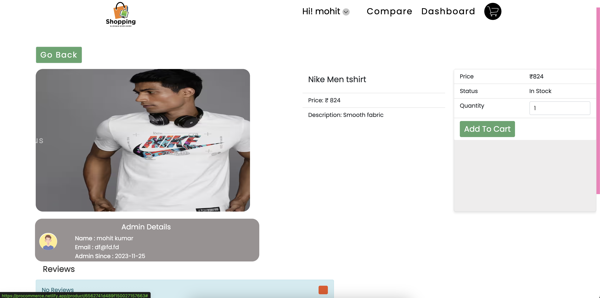
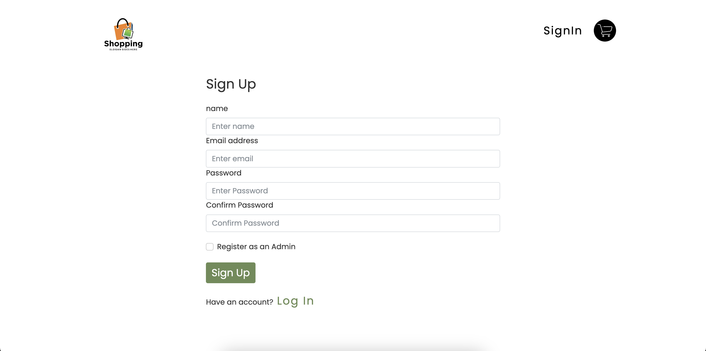

# ProCommerce

Welcome to Pro Commerces, a dynamic application that allows users to compare products from different websites, create new products, and manage their product lists.


## Features

- **Advanced Comparison Section:** Compare products from various websites like **Amazon, Flipkart, Shopclues, Snapdeal, and Nykaa**, based on parameters like price, comparision websites, and reviews.

- **Create and Delete Products:** Admin Users can create, delete products and other users can buy

- **User Registration:** Create an account (as an admin or as a normal user) on our website using JWT user authentication for a personalized Ecommerce experience

- **Reviews Feature:** Users can leave reviews for products and view reviews from other users.

- **Add to Cart Feature:** Users can add products to their cart for future reference or purchase.


### Live link: [Procommerce](https://procommerce.netlify.app)

# Screenshots:


### Admin's Dashboard


### Advance Comparision page


### Create Product Page(Only for admins)


### Home page


### Product Details Page


### Register Page



## Tech Stack

- **Frontend:** Built with ReactJS and hosted on Netlify, providing a smooth and responsive user interface.

- **Backend:** Powered by NodeJS and Express, with MongoDB as the database for efficient data storage.

- **Media Storage:** Images for products are stored on Cloudinary.

- **Authentication:** JWT (JSON Web Tokens) are used for secure user authentication, ensuring a safe and seamless login process.

- **Design:** Figma was utilized for the design process, ensuring a visually appealing and user-friendly interface.


## Getting Started

1. Clone the repository:

   ```bash
   git clone https://github.com/hellomohitsangwan/procommerce.git

2. Install dependencies:
   ```bash
    cd procommerce/client
    npm install
    cd ../serve
    npm install

3. Start the application:
   ```bash
    # Start webapp
    npm run dev


4. Visit http://localhost:3000 to access the ProCommerce application.